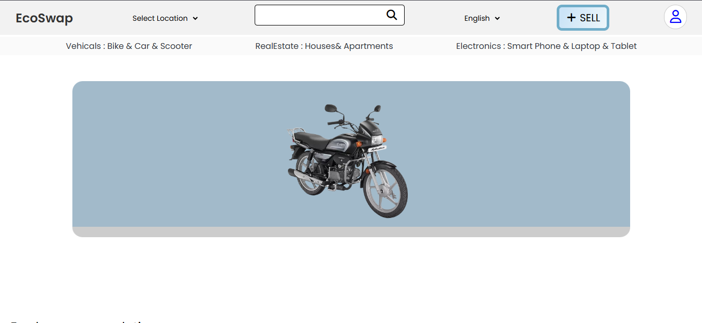

# Ecoswap

EcoSwap is an online marketplace designed for sustainability and savvy shopping. It’s where pre-loved treasures find new homes, and where buyers can discover unique, high-quality used products at unbeatable prices. From vintage homes and electronics to fashion and collectibles, EcoSwap offers a wide range of items, making it easy to buy and sell with confidence. Join our community of eco-conscious consumers and start swapping today, turning one person's old into another's gold! 🌱💼
 

 

## Key Features

### Categorized Listings
Ecoswap offers a variety of product categories to cater to diverse needs, including:

- *Vehicles* (cars, bikes, etc.)
- *Real Estate* (homes, properties, etc.)
- *Electronics* (mobile phones, laptops, etc.)

### User Authentication
- Secure login and registration pages for creating and managing user accounts.

### Ad Posting
- An intuitive interface that enables sellers to create and publish product ads with detailed descriptions.

### Checkout System
- A simple and secure checkout page to finalize purchases.

### Responsive Design
- Optimized for mobile, tablet, and desktop devices to ensure a seamless experience.

---

## Technologies Used

Ecoswap is built using modern web development technologies:

- *Frontend*: HTML, CSS, JavaScript
- *Version Control & Collaboration*: Git and GitHub

---

## How to Use

1. *User Registration and Login*:
   - Users can register for an account or log in to access Ecoswap's features.

2. *Browsing Categories*:
   - Products are organized into categories for easy navigation.

3. *Ad Posting*:
   - Sellers can post ads by providing product descriptions, images, and other necessary details.

4. *Making a Purchase*:
   - Buyers can select products and complete their purchases through a streamlined checkout page.

---

## Project Structure Overview

The project is organized into structured directories for easy navigation, with separate folders for:

- HTML pages
- CSS styles
- JavaScript functionality
- Assets (e.g., images)

---
Here's your updated *Project Members and Contributions* section with the correct GitHub links for all the contributors:

---

## Project Members and Contributions

- *Akash Amode*: Main home page, Ad post page  
  GitHub: [AKashAMode](https://github.com/AKashAMode)
- *Suraj Ghogare*: Electronics products main page  
  GitHub: [Surajghogare80](https://github.com/Surajghogare80)
- *Vandita Satarde*: Real Estate products main page  
  GitHub: [vandita-satarde](https://github.com/vandita-satarde)
- *Vaishnavi Kolse*: Real Estate product checkout pages  
  GitHub: [VaishnaviKolse](https://github.com/VaishnaviKolse)
- *Rasika Shete*: Vehicles main page  
  GitHub: [sheterasika](https://github.com/sheterasika/)
- *Siddi Pagire*: Vehicles product checkout pages  
  GitHub: [Miss-Siddhi-Pagire](https://github.com/Miss-Siddhi-Pagire)
- *Kiran More*: Product ad form  
  GitHub: [kiranmore2404](https://github.com/kiranmore2404)
- *Rushikesh Salunke*: Signup and login page  
  GitHub: [rushikeshsalunkhe01](https://github.com/rushikeshsalunkhe01)
- *Aastha Dhongade*: Contact page  
  GitHub: [Aastha7378](https://github.com/Aastha7378)

<table>
  <tr>
    <td align="center"><a href="https://github.com/AKashAMode"> <b>Akash Amode</b></a></td>
    <td align="center"><a href="https://github.com/Surajghogare80"> <b>Suraj Ghogare</b></a></td>
    <td align="center"><a href="https://github.com/vandita-satarde"> <b>Vandita Satarde</b></a></td>
    <td align="center"><a href="https://github.com/VaishnaviKolse"> <b>Vaishnavi Kolse</b></a></td>
    <td align="center"><a href="https://github.com/sheterasika"> <b>Rasika Shete</b></a></td>
    <td align="center"><a href="https://github.com/Miss-Siddhi-Pagire"> <b>Siddi Pagire</b></a></td>
    <td align="center"><a href="https://github.com/kiranmore2404"> <b>Kiran More</b></a></td>
    <td align="center"><a href="https://github.com/rushikeshsalunkhe01"> <b>Rushikesh Salunke</b></a></td>
    <td align="center"><a href="https://github.com/Aastha7378"> <b>Aastha Dhongade</b></a></td>
    
    
</tr>
</table>
---

Let me know if you need any further changes!
## Contributions

Contributions to the project are welcome. Developers can:

1. Fork the repository.
2. Create a branch for their feature.
3. Submit a pull request after implementation.

---

## License

This project is licensed under the MIT License - see the [LICENSE](LICENSE) file for details.

---
